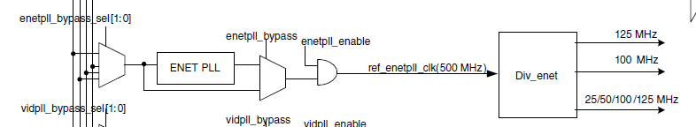
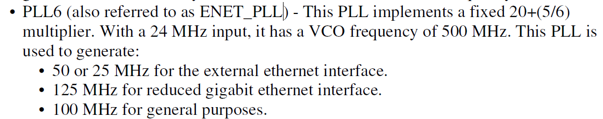
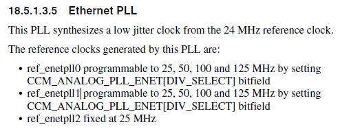
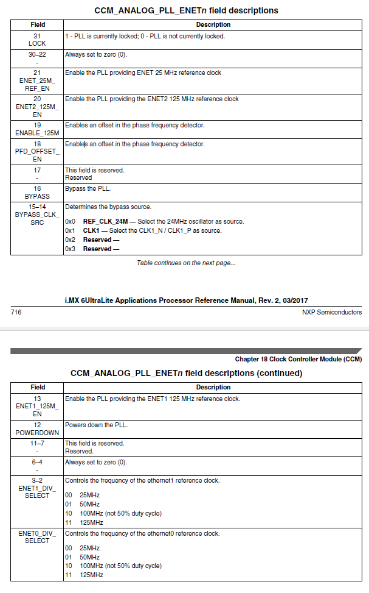
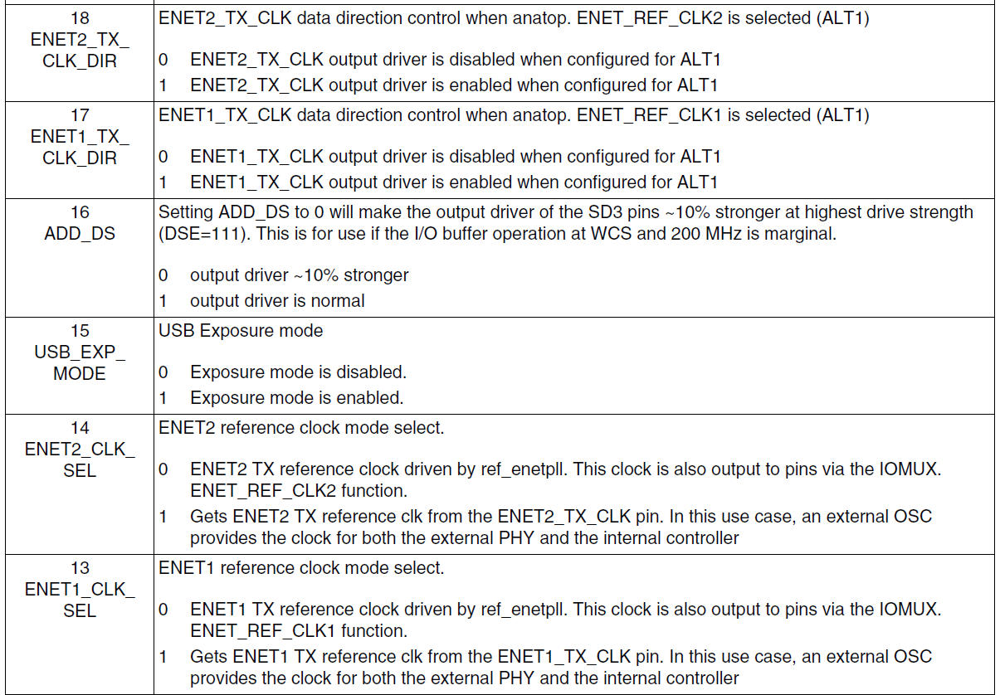
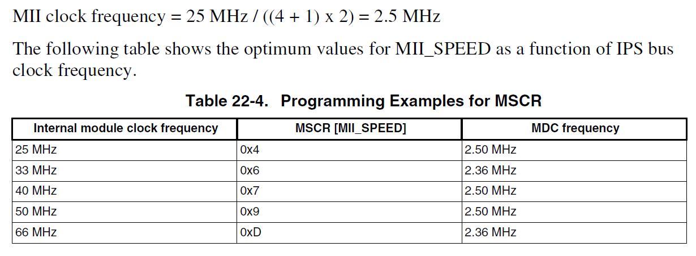

# 以太网驱动移植文件

## 一、背景

- rt-smart的`imx6ull-artpi-smart`BSP包（以下简称`ull`）对应的板子使用的网络硬件和mx6Ul不同
- 芯片上，`ull`使用的是LAN8720，`ul`使用的是KSZ8080
- 连线上，`ull`的RESET管脚直接和MCU管脚连接，而`ul`的RESET管脚通过串转并芯片`SN74HC595`连接

## 二、解决思路

- NXP官方的`imx6ul-evk`的硬件连接和`ul`相同
- 可以参考`uboot-imx`代码

## 三、实现

#### 3.1重启实现

由于重启管脚连接到了串转并电路，因此首先需要实现串转并的驱动或者功能以供调用

##### 3.1.1串转并驱动

###### Step1管脚复用设置

将控制串转并的四个管脚设置为GPIO，在`fsl_enet.c`中实现，代码如下

```c
    /*设置串转并管脚*/
    RT_IOMUXC_SetPinMux(IOMUXC_SNVS_BOOT_MODE0_GPIO5_IO10, 0U);
    RT_IOMUXC_SetPinConfig(IOMUXC_SNVS_BOOT_MODE0_GPIO5_IO10,
                        IOMUXC_SW_PAD_CTL_PAD_DSE(6U) |
                        IOMUXC_SW_PAD_CTL_PAD_SPEED(2U) |
                        IOMUXC_SW_PAD_CTL_PAD_PKE_MASK |
                        IOMUXC_SW_PAD_CTL_PAD_HYS_MASK);
    RT_IOMUXC_SetPinMux(IOMUXC_SNVS_BOOT_MODE1_GPIO5_IO11, 0U);
    RT_IOMUXC_SetPinConfig(IOMUXC_SNVS_BOOT_MODE1_GPIO5_IO11,
                        IOMUXC_SW_PAD_CTL_PAD_DSE(6U) |
                        IOMUXC_SW_PAD_CTL_PAD_SPEED(2U) |
                        IOMUXC_SW_PAD_CTL_PAD_PKE_MASK |
                        IOMUXC_SW_PAD_CTL_PAD_HYS_MASK);
    RT_IOMUXC_SetPinMux(IOMUXC_SNVS_SNVS_TAMPER7_GPIO5_IO07, 0U);
    RT_IOMUXC_SetPinConfig(IOMUXC_SNVS_SNVS_TAMPER7_GPIO5_IO07,
                        IOMUXC_SW_PAD_CTL_PAD_DSE(6U) |
                        IOMUXC_SW_PAD_CTL_PAD_SPEED(2U) |
                        IOMUXC_SW_PAD_CTL_PAD_PKE_MASK |
                        IOMUXC_SW_PAD_CTL_PAD_HYS_MASK);
    RT_IOMUXC_SetPinMux(IOMUXC_SNVS_SNVS_TAMPER8_GPIO5_IO08, 0U);
    RT_IOMUXC_SetPinConfig(IOMUXC_SNVS_SNVS_TAMPER8_GPIO5_IO08,
                        IOMUXC_SW_PAD_CTL_PAD_DSE(6U) |
                        IOMUXC_SW_PAD_CTL_PAD_SPEED(2U) |
                        IOMUXC_SW_PAD_CTL_PAD_PKE_MASK |
                        IOMUXC_SW_PAD_CTL_PAD_HYS_MASK);
    /*串转并管脚设置end*/
```

###### Step2 管脚方向设置及重启设置

在`fsl_phy.c`的`phy_reset()`函数中实现，代码如下

```c
enum qn {
	HDMI_NRST,
	ENET1_NRST,
	ENET2_NRST,
	CAN1_2_STBY,
	BT_NPWD,
	CSI_RST,
	CSI_PWDN,
	LCD_NPWREN,
};

enum qn_func {
	qn_reset,
	qn_enable,
	qn_disable,
};

enum qn_level {
	qn_low = 0,
	qn_high = 1,
};

static enum qn_level seq[3][2] = {
	{0, 1}, {1, 1}, {0, 0}
};

static enum qn_func qn_output[8] = {
	qn_reset, qn_reset, qn_reset, qn_enable, qn_disable, qn_reset,
	qn_disable, qn_disable
};

#define IOX_STCP_PIN 7
#define IOX_OE_PIN 8
#define IOX_SDI_PIN 10
#define IOX_SHCP_PIN 11

static void iox74lv_init(void)
{
	int i;
    GPIO_Type *gpio_base = NULL;
    gpio_pin_config_t sw_config =
    {
        kGPIO_DigitalOutput,
        0,
        kGPIO_NoIntmode,
    };
    /*获取GPIO5寄存器基地址*/
    gpio_base = (GPIO_Type *)rt_ioremap((void *)PHY_SW_GPIO,0x1000);
    /*设置相关引脚为输出*/
    GPIO_PinInit(gpio_base, IOX_STCP_PIN, &sw_config);
    GPIO_PinInit(gpio_base, IOX_OE_PIN, &sw_config);
    GPIO_PinInit(gpio_base, IOX_SDI_PIN, &sw_config);
    GPIO_PinInit(gpio_base, IOX_SHCP_PIN, &sw_config);
    /*设置OE输出低电平*/
    GPIO_WritePinOutput(gpio_base, IOX_OE_PIN, 0);

	for (i = 7; i >= 0; i--) {
        /*设置SHCP输出低电平*/
        GPIO_WritePinOutput(gpio_base, IOX_SHCP_PIN, 0);
		/*设置SDI输出低电平*/
        GPIO_WritePinOutput(gpio_base, IOX_SDI_PIN, seq[qn_output[i]][0]);
		rt_thread_delay(50);
        /*设置SHCP输出高电平*/
        GPIO_WritePinOutput(gpio_base, IOX_SHCP_PIN, 1);
		rt_thread_delay(50);
	}
    /*设置STCP输出低电平*/
    GPIO_WritePinOutput(gpio_base, IOX_STCP_PIN, 0);
	rt_thread_delay(50);
	/*
	 * shift register will be output to pins
	 */
    /*设置STCP输出高电平*/
    GPIO_WritePinOutput(gpio_base, IOX_STCP_PIN, 1);

	for (i = 7; i >= 0; i--) {
        /*设置SHCP输出低电平*/
        GPIO_WritePinOutput(gpio_base, IOX_SHCP_PIN, 0);
        /*设置SDI输出低电平*/
        GPIO_WritePinOutput(gpio_base, IOX_SDI_PIN, seq[qn_output[i]][1]);
		rt_thread_delay(50);
        /*设置SHCP输出高电平*/
        GPIO_WritePinOutput(gpio_base, IOX_SHCP_PIN, 1);
		rt_thread_delay(50);
	}
    /*设置STCP输出低电平*/
    GPIO_WritePinOutput(gpio_base, IOX_STCP_PIN, 0);
	rt_thread_delay(50);
	/*
	 * shift register will be output to pins
	 */
    /*设置STCP输出高电平*/
    GPIO_WritePinOutput(gpio_base, IOX_STCP_PIN, 1);
}

status_t phy_reset()
{
    iox74lv_init();
    return kStatus_Success;
}
```

由于PHY的重启前需要定义好管脚，因此调整`drv_eth.c中rt_imx6ul_eth_init()`函数调用的顺序

```c
    ENET_InitPins();
    phy_reset();
```

STEP4 时钟频率设置

修改`drv_eth.c中ENET_InitModuleClock()`函数，注释掉的是原代码

```c
void ENET_InitModuleClock(void)
{
    /*const clock_enet_pll_config_t config = {true, true, false, 1, 1};*/
    const clock_enet_pll_config_t config = {false, true, false, 0, 0};
    CLOCK_InitEnetPll(&config);
}
```

## 四、调试记录

wireshark抓包记录

0000-255255255255的DHCP的包

以及一个ICMPV6的包

Ping指令可以正常发出ARP，目标主机也回复了ARP，但是没有接收

速率 双工设置是否一致

是否开启了自动关闭

ping函数使用的是`netdev.c中的netdev_cmd_ping`函数，再调用`lwip-2.1.2`下的`ethernetif.c`中的`lwip_netdev_ping`函数

再调用`ping.c`的`lwip_ping_recv`函数， 再调用`sockets.c中的lwip_recvfrom`函数

创建负责接收的socket的类型不是TCP，也不是UDP，也不是IPV6，而是Raw connection

###### netdev.c函数

创建socket，类型RAW，协议ICMP

```c
    /* new a socket */
    if ((s = lwip_socket(AF_INET, SOCK_RAW, IP_PROTO_ICMP)) < 0)
    {
        return -RT_ERROR;
    }
```

部分调试记录见rtthread论坛的发帖记录：https://club.rt-thread.org/ask/question/434275.html

2022-1-12问题梳理

- ARP可以正确解析
- ICMP不能正确解析，出现协议、数据包头的解析错误

###### 设置为10M全双工试试

1. 设置PHY为10M全双工
2. 设置MAC控制器RCR寄存器

## 五、移植总结

#### 5.1管脚定义

定义相关管脚

#### 5.2 时钟初始化

###### 选择时钟









```
void CLOCK_InitEnetPll(const clock_enet_pll_config_t *config)
{
    uint32_t enet_pll = CCM_ANALOG_PLL_ENET_ENET1_DIV_SELECT(config->loopDivider1) |
                        CCM_ANALOG_PLL_ENET_ENET0_DIV_SELECT(config->loopDivider0);

    if (config->enableClkOutput0)
    {
        enet_pll |= CCM_ANALOG_PLL_ENET_ENET1_125M_EN_MASK;
    }

    if (config->enableClkOutput1)
    {
        enet_pll |= CCM_ANALOG_PLL_ENET_ENET2_125M_EN_MASK;
    }

    if (config->enableClkOutput2)
    {
        enet_pll |= CCM_ANALOG_PLL_ENET_ENET_25M_REF_EN_MASK;
    }

    CCM_ANALOG->PLL_ENET = enet_pll;

    /* Wait for stable */
    while ((CCM_ANALOG->PLL_ENET & CCM_ANALOG_PLL_ENET_LOCK_MASK) == 0)
    {
    }
}

typedef struct _clock_enet_pll_config
{
    bool     enableClkOutput0;  /*!< Power on and enable PLL clock output for ENET0 (ref_enetpll0). */
    bool     enableClkOutput1;  /*!< Power on and enable PLL clock output for ENET1 (ref_enetpll1). */
    bool     enableClkOutput2;  /*!< Power on and enable PLL clock output for ENET2 (ref_enetpll2). */
    uint8_t  loopDivider0;      /*!< Controls the frequency of the ENET0 reference clock.
                                     b00 25MHz
                                     b01 50MHz
                                     b10 100MHz (not 50% duty cycle)
                                     b11 125MHz */
    uint8_t  loopDivider1;      /*!< Controls the frequency of the ENET1 reference clock.
                                     b00 25MHz
                                     b01 50MHz
                                     b10 100MHz (not 50% duty cycle)
                                     b11 125MHz */
} clock_enet_pll_config_t;
```

需要说明的是，系统有三个ENET时钟，ref_enetpll0~ref_enetpll2，分别对应三个ENET模块，实际上，CPU只有两个ENET模块，因此ref_enetpll2是没有被使用的。其中

- ref_enetpll0、ref_enetpll1的输入时钟为125MHz，输出可选25/50/100/125MHz
- ref_enetpll2固定输出25MHz

设置ENET_EN使能，设置ENET_DIV_SELECT选择频率

在本例中，使用ref_enetpll1的50MHz输出

###### 使能时钟

设置GPR->GPR1寄存器，DIR设置为1使能，SEL设置为0，方向为输出



```c
    IOMUXC_GPR_Type *GPR1 = (IOMUXC_GPR_Type *)rt_ioremap((void *)IOMUXC_GPR,0x1000);
    reg_value = GPR1->GPR1;
    reg_value &= ~(IOMUXC_GPR_GPR1_ENET2_CLK_SEL_MASK
                 | IOMUXC_GPR_GPR1_ENET2_CLK_SEL_MASK);
    reg_value |=  IOMUXC_GPR_GPR1_ENET2_TX_CLK_DIR(1);
    reg_value |=  IOMUXC_GPR_GPR1_ENET2_CLK_SEL(0);
```

#### 5.3 PHY初始化

初始化PHY需要对应PHY电路的PHY address

###### PHY Manage Interface初始化即功能设计

也被称为Serial Manager Interface（SMI）， 即和PHY通信的接口

初始化分为两部分：管脚初始化、控制寄存器初始化；其中管脚为

- MDC：时钟
- MDIO：数据

管理寄存器为MSCR，需要设置时钟频率、输出电平Hold Time、是否禁止preamble



其中时钟频率的设置如上图，ENET的IPS bus即为AHB bus。MDC时钟的值需要等于或者稍微小于2.5MHz。

功能设计包括PHY_Write、PHY_Read，主要是操作MMFR寄存器，由于这是标准化操作，可以直接使用通用代码。

###### 读取PHY ID并验证

```c
    while ((idReg != PHY_CONTROL_ID1) && (counter != 0))
    {
        PHY_Read(base, phyAddr, PHY_ID1_REG, &idReg);
        counter --;       
    }

    if (!counter)
    {
        return kStatus_Fail;
    }
```

###### PHY软重启

设置PHY芯片的相关寄存器（basic control），重启PHY

```c
PHY_Write(base, phyAddr, PHY_BASICCONTROL_REG, PHY_BCTL_RESET_MASK);
```

###### 设置PHY频率

在本例中，PHY的频率由系统的`ENET2_TCK`管脚提供，为50MHz

```c
    uint32_t data = 0;
    result = PHY_Read(base, phyAddr, PHY_CONTROL2_REG, &data);
    if ( result != kStatus_Success)
    {
        return result;
    }
    result = PHY_Write(base, phyAddr, PHY_CONTROL2_REG, (data | PHY_CTL2_REFCLK_SELECT_MASK));
    if (result != kStatus_Success)
    {
        return result;
    }
```

需要说明的是，网络的传输速度和传输模式（全/半双工）不是通过PHY寄存器设置的，而是通过上电时相关管脚的电平高低设置的，具体见PHY芯片的数据手册

###### 判断PHY状态

读取PHY的basic status寄存器，判断是否Link Up

如果连接成功，进入下一步

#### 5.4 ENET初始化

###### 重启系统的ENET模块

设置ENET的ECR寄存器RESET位，重启模块

```c
static inline void ENET_Reset(ENET_Type *base)
{
    base->ECR |= ENET_ECR_RESET_MASK;
}
```

###### 设置ENET模块RCR寄存器

- 设置ENET工作在MII还是RMII模式
- 设置传输速度

###### 设置ENET模块TCR寄存器

- 设置全双工/半双工

###### 设置缓存相关寄存器

TFWR、RSFL、MRBR等

###### 设置Mac地址

###### 使能中断

###### 使能ENET

设置ECR寄存器使能位

###### 设置中断服务函数

###### 使能接收

###### 使能系统中断

## 六、ARP协议学习

#### 作用

Address Resolution Protocol，地址解析协议，沟通IP地址与MAC地址的作用

可以根据IP查MAC，不能根据MAC查IP

#### 报文结构（28Bytes）

以太网首部（14Bytes，不属于ARP报文）

- 以太网目的地址：6Bytes
- 以太网源地址：6Bytes
- 帧类型：2bytes（806代表ARP）

APR报文（28Bytes）

- 硬件类型：2
- 协议类型：2
- 地址长度：1
- 协议长度：1
- op：2（Request、Reply）
- 发送段以太网地址：6
- 发送端IP地址：4
- 目的以太网地址：6
- 目的IP地址：4

## 七、uboot网络驱动代码分析

uboot和网络驱动相关的代码分为三部分，对于`mx6ulevk`板分别位于：

- 文件1：`board\freescale\mx6ulevk\mx6ulevk.c`
- 文件2：`drivers\net\fec_mxc.c`
- 文件3：`net\eth.c`

其中相互关系是

文件1中，board_init调用

- iox74lv_init重启phy
- setup_fec使能时钟
  - 配置GPR，选择REF_CLK的方式（输出/输入），并使能输出
  - 配置CCM_ANALOG_PLL_ENET，使能对应ENET接口的时钟，并选择频率
  - 配置CCM_CCGR3寄存器，使能整个ENET模块的时钟

在文件1中，还定义了两个函数

- board_eth_init，该函数

  - 初始化管脚

  - 并调用文件2的fecmxc_initialize_multi

  - 但board_eth_init在文件1中并没有被调用，而是被文件3的eth_initialize函数调用

- board_phy_config，该函数

  - 设置phy的PHY_CONTROL2_REG寄存器为0x8190，即LED状态，RMII时钟50M等
  - 该函数在phy.c中被调用

因此三个文件的调用关系是：文件3->文件1->文件2

##### 文件3

在文件3的eth_initialize中，依次调用phy_init，board_eth_init

###### 调用顺序

1. fecmxc_initialize_multi
   1. fec_get_miibus
   2. phy_find_by_mask
   3. fec_probe
      1. reset_chip
      2. fec_reg_setup
         1. 设置RCR
      3. fec_mii_setspeed
      4. phy_soft_reset
      5. board_eth_init
      6. eth_register
2. fec_init
   1. fec_set_hwaddr
      - 设置IP地址
      - 设置IUAR等寄存器
   2. fec_tbd_init
   3. fec_rbd_init
   4. miiphy_restart_aneg
   5. fec_open

## 八、lwip修改记录

1. udp.c

   第360行，加入

   ```c
       /*ledoen*/
       rt_kprintf("chkerr was ignored by ledoen\n");
       /*goto chkerr;*/
   ```

   

2. dhcp.c

   第1791行，加入

   ```c
     /*ledoen*/
     for (size_t ledoen_i = 0; ledoen_i < netif->hwaddr_len; ledoen_i++)
     {
       rt_kprintf("*****ledoen*****hwaddr:%d\tchaddr:%d\n", netif->hwaddr[ledoen_i], reply_msg-					>chaddr[ledoen_i]);
     }
   ```

   第1803行，加入

   ```c
         /*ledoen*/
         rt_kprintf("hardware mismatch ignored by ledoen\n");
         /*goto free_pbuf_and_return;*/
   ```

   

```c
ethernet_input: dest:a8:5e:45:31:32:33, src:ac:9e:17:e9:7d:b8, type:800
udp_input: received datagram of length 308
UDP header:
+-------------------------------+
|        67     |        68     | (src port, dest port)
+-------------------------------+
|       308     |     0x983d    | (len, chksum)
+-------------------------------+
udp (192.168.50.225, 68) <-- (192.168.50.1, 67)
pcb (0.0.0.0, 68) <-- (0.0.0.0, 67)
udp_input: calculating checksum
chkerr was ignored by ledoen
dhcp_recv(pbuf = c017319c) from DHCP server 192.168.50.1 port 67
pbuf->len = 300
pbuf->tot_len = 300
*****ledoen*****hwaddr:168      chaddr:168
*****ledoen*****hwaddr:94       chaddr:10
*****ledoen*****hwaddr:69       chaddr:0
*****ledoen*****hwaddr:49       chaddr:32
*****ledoen*****hwaddr:50       chaddr:34
*****ledoen*****hwaddr:51       chaddr:34
netif->hwaddr[1]==5e != reply_msg->chaddr[1]==0a
```

```c
ethernet_input: dest:a8:5e:45:31:32:33, src:ac:9e:17:e9:7d:b8, type:800
udp_input: received datagram of length 308
UDP header:
+-------------------------------+
|        67     |        68     | (src port, dest port)
+-------------------------------+
|       308     |     0x983d    | (len, chksum)
+-------------------------------+
udp (192.168.50.225, 68) <-- (192.168.50.1, 67)
pcb (0.0.0.0, 68) <-- (0.0.0.0, 67)
udp_input: calculating checksum
chkerr was ignored by ledoen
dhcp_recv(pbuf = c017319c) from DHCP server 192.168.50.1 port 67
pbuf->len = 300
pbuf->tot_len = 300
*****ledoen*****hwaddr:168      chaddr:168
*****ledoen*****hwaddr:94       chaddr:10
*****ledoen*****hwaddr:69       chaddr:0
*****ledoen*****hwaddr:49       chaddr:32
*****ledoen*****hwaddr:50       chaddr:34
*****ledoen*****hwaddr:51       chaddr:34
netif->hwaddr[1]==5e != reply_msg->chaddr[1]==0a
hardware mismatch ignored by ledoen
netif->hwaddr[2]==45 != reply_msg->chaddr[2]==00
hardware mismatch ignored by ledoen
netif->hwaddr[3]==31 != reply_msg->chaddr[3]==20
hardware mismatch ignored by ledoen
netif->hwaddr[4]==32 != reply_msg->chaddr[4]==22
hardware mismatch ignored by ledoen
netif->hwaddr[5]==33 != reply_msg->chaddr[5]==22
hardware mismatch ignored by ledoen
transaction id mismatch reply_msg->xid(20088222)!=dhcp->xid(6058c667)
```

ENET收到数据，放入fifo，由DMA将数据从fifo放入RxBD

使用uboot打印相关信息

## 九、Buffer Descriptor分析

#### 9.1定义

##### 总述

以接收缓存为例，使用缓存描述结构体实现环形缓冲区

- 一共由rxBdNumber个缓存
- 每个缓存的大小为rxBuffSizeAlign
- 缓存描述开始地址（第一个缓存描述地址）rxBdStartAddrAlign
- 缓存开始地址（第一个缓存地址）rxBufferAlign

###### enet_buffer_t

定义缓存的顶级结构体

```c
typedef struct _enet_buffer_config
{
    uint16_t rxBdNumber;                              /*!< Receive buffer descriptor number. */
    uint16_t txBdNumber;                              /*!< Transmit buffer descriptor number. */
    uint32_t rxBuffSizeAlign;                         /*!< Aligned receive data buffer size. */
    uint32_t txBuffSizeAlign;                         /*!< Aligned transmit data buffer size. */
    volatile enet_rx_bd_struct_t *rxBdStartAddrAlign; /*!< Aligned receive buffer descriptor start address. */
    volatile enet_tx_bd_struct_t *txBdStartAddrAlign; /*!< Aligned transmit buffer descriptor start address. */
    uint8_t *rxBufferAlign;                           /*!< Receive data buffer start address. */
    uint8_t *txBufferAlign;                           /*!< Transmit data buffer start address. */
} enet_buffer_config_t;
```

##### 缓存描述体

缓存描述体实现了线性的缓存区域变成环形

- 描述缓存的大小，length，由MAC（即ENET控制器）接收到数据后自动填写
  -  如果该描述体control的L位（即Frame的最后一个bd）为0，则length为该bd的数据长度
  - 如果L位为1，则length为整个Frame的长度（包括多个bd的数据）
- 描述缓存的状态，control，大部分由MAC自动填写，其中W，即是否该缓存为最后一个缓存（rxBdNumber-1），由用户在创建该结构体时填写
- 描述缓存的地址，buffer，起始地址为rxBufferAlign[0]， 第1个缓存地址为rxBufferAlign[1 * rxBuffSizeAlign]

###### enet_rx_bd_struct_t

定义缓存描述体的结构体

```c
typedef struct _enet_rx_bd_struct
{
    uint16_t length;  /*!< Buffer descriptor data length. */
    uint16_t control; /*!< Buffer descriptor control and status. */
    uint8_t *buffer;  /*!< Data buffer pointer. */
} enet_rx_bd_struct_t;
```

##### 实现案例

###### 案例一：官方SDK

```c
#define APP_ENET_BUFF_ALIGNMENT MAX(ENET_BUFF_ALIGNMENT, FSL_FEATURE_L1DCACHE_LINESIZE_BYTE)
#define ENET_RXBD_NUM (4)
#define ENET_TXBD_NUM (4)
#define ENET_RXBUFF_SIZE (ENET_FRAME_MAX_FRAMELEN)
#define ENET_TXBUFF_SIZE (ENET_FRAME_MAX_FRAMELEN)
#define ENET_DATA_LENGTH (1000)
#define ENET_TRANSMIT_DATA_NUM (20)
#ifndef APP_ENET_BUFF_ALIGNMENT

enet_buffer_config_t buffConfig = {
    ENET_RXBD_NUM,
    ENET_TXBD_NUM,
    1536,
    1536,
    &g_rxBuffDescrip[0],
    &g_txBuffDescrip[0],
    &g_rxDataBuff[0][0],
    &g_txDataBuff[0][0],
};

enet_rx_bd_struct_t g_rxBuffDescrip[ENET_RXBD_NUM];
uint8_t g_rxDataBuff[ENET_RXBD_NUM][1536];
```

由以上定义可知，系统定义了4个接收缓存，每个缓存的大小是1536Bytes，

###### 案例二：rt-smart

```c
#define ENET_RXBD_NUM (128)
#define ENET_TXBD_NUM (128)
#define ENET_RXBUFF_ALIGN_SIZE (1536)
#define ENET_TXBUFF_ALIGN_SIZE (1536)
#define ENET_RXBUFF_TOTAL_SIZE (ENET_RXBD_NUM*ENET_RXBUFF_ALIGN_SIZE)
#define ENET_TXBUFF_TOTAL_SIZE (ENET_TXBD_NUM*ENET_TXBUFF_ALIGN_SIZE)
enet_buffer_config_t buffConfig = {
    ENET_RXBD_NUM,
    ENET_TXBD_NUM,
    ENET_RXBUFF_ALIGN_SIZE,
    ENET_TXBUFF_ALIGN_SIZE,
    NULL,
    NULL,
    NULL,
    NULL,
    NULL,
    NULL,
    NULL,
    NULL,
    ENET_RXBUFF_TOTAL_SIZE,
    ENET_TXBUFF_TOTAL_SIZE,
};
typedef struct _enet_buffer_config
{
    uint16_t rxBdNumber;                              /*!< Receive buffer descriptor number. */
    uint16_t txBdNumber;                              /*!< Transmit buffer descriptor number. */
    uint32_t rxBuffSizeAlign;                         /*!< Aligned receive data buffer size. */
    uint32_t txBuffSizeAlign;                         /*!< Aligned transmit data buffer size. */
    volatile enet_rx_bd_struct_t *rxBdStartAddrAlign; /*!< Aligned receive buffer descriptor start address. */
    volatile enet_tx_bd_struct_t *txBdStartAddrAlign; /*!< Aligned transmit buffer descriptor start address. */
    uint8_t *rxBufferAlign;                           /*!< Receive data buffer start address. */
    uint8_t *txBufferAlign;                           /*!< Transmit data buffer start address. */
    void *rxPhyBdStartAddrAlign;                      /*!< Aligned receive buffer descriptor physical start address. */
    void *txPhyBdStartAddrAlign;                      /*!< Aligned transmit buffer descriptor physical start address. */
    uint8_t *rxPhyBufferAlign;                        /*!< Receive data buffer physical start address. */
    uint8_t *txPhyBufferAlign;                        /*!< Transmit data buffer physical start address. */
    uint32_t rxBufferTotalSize;                       /*!< Receive data buffer max size. */
    uint32_t txBufferTotalSize;                       /*!< Transmit data buffer max size. */
} enet_buffer_config_t;

```

可以看到，定义了128个接收缓存，每个缓存的大小是1536。除了基础的定义之外，还扩展了几个参数

- 描述体/缓存的物理起始地址，由于rt-smart启用了地址映射，因此存在虚拟地址和物理地址之分
- 缓存区的总体大小 = 个数 * 尺寸

###### 案例三：uboot

```c
#define FEC_RBD_NUM		64
#define FEC_MAX_PKT_SIZE	1536

struct fec_priv {
	struct ethernet_regs *eth;	/* pointer to register'S base */
	enum xceiver_type xcv_type;	/* transceiver type */
	struct fec_bd *rbd_base;	/* RBD ring */
	int rbd_index;			/* next receive BD to read */
	struct fec_bd *tbd_base;	/* TBD ring */
	int tbd_index;			/* next transmit BD to write */
	bd_t *bd;
	uint8_t *tdb_ptr;
	int dev_id;
	struct mii_dev *bus;
	struct phy_device *phydev;
};

struct fec_bd {
	uint16_t data_length;		/* payload's length in bytes */
	uint16_t status;			/* BD's staus (see datasheet) */
	uint32_t data_pointer;		/* payload's buffer address */
};
```

由以上定义可以，定义了64个接收缓存，每个缓存大小为1536Bytes

#### 9.2初始化

##### 初始化的总体过程

以接收缓存为例，将接收缓存描述体起始地址传入初始化函数，从第一个描述体开始，初始化

- length = 0
- control = empty
- *buffer = 第一个缓存地址，初始化前需要向内存获取该区域

一次将rxBdNumber个缓存描述体进行初始化，进行到最后一个时，将该描述体config的W位置1

##### 实现

###### 案例一：官方SDK

```c
//【1】定义缓存及缓存描述体
enet_rx_bd_struct_t g_rxBuffDescrip[4];
enet_tx_bd_struct_t g_txBuffDescrip[4];

SDK_ALIGN(uint8_t g_rxDataBuff[4][1536];
SDK_ALIGN(uint8_t g_txDataBuff[4][1536];

//【2】使用定义的缓存变量
enet_buffer_config_t buffConfig = {
    ENET_RXBD_NUM,
    ENET_TXBD_NUM,
    1536,
    1536,
    &g_rxBuffDescrip[0],
    &g_txBuffDescrip[0],
    &g_rxDataBuff[0][0],
    &g_txDataBuff[0][0],
};
//【3】初始化缓存
static void ENET_SetRxBufferDescriptors(volatile enet_rx_bd_struct_t *rxBdStartAlign,
                                        uint8_t *rxBuffStartAlign,
                                        uint32_t rxBuffSizeAlign,
                                        uint32_t rxBdNumber,
                                        bool enableInterrupt)
{
    assert(rxBdStartAlign);
    assert(rxBuffStartAlign);

    volatile enet_rx_bd_struct_t *curBuffDescrip = rxBdStartAlign;
    uint32_t count = 0;

    /* Initializes receive buffer descriptors. */
    for (count = 0; count < rxBdNumber; count++)
    {
        /* Set data buffer and the length. */
        //初始化缓存指针
        curBuffDescrip->buffer = (uint8_t *)((uint32_t)&rxBuffStartAlign[count * rxBuffSizeAlign]);
        //初始化数据长度
        curBuffDescrip->length = 0;

        /* Initializes the buffer descriptors with empty bit. */
        //初始化config
        curBuffDescrip->control = ENET_BUFFDESCRIPTOR_RX_EMPTY_MASK;
        /* Sets the last buffer descriptor with the wrap flag. */
        if (count == rxBdNumber - 1)
        {
            //如果是最后一个缓存描述体，设置config的W位
            curBuffDescrip->control |= ENET_BUFFDESCRIPTOR_RX_WRAP_MASK;
        }
		//如果缓存处于DCache区，则需要清除DCache
        /* Add cache clean operation. */
        DCACHE_CleanByRange((uint32_t)curBuffDescrip, sizeof(enet_rx_bd_struct_t));

        /* Increase the index. */
        curBuffDescrip++;
    }
}
```

###### 案例二：rt-smart

```c
//与SDK不同的是，本案例并没有先定义定义缓存及缓存描述体
//【1】定义总体结构
enet_buffer_config_t buffConfig = {
    ENET_RXBD_NUM,
    ENET_TXBD_NUM,
    ENET_RXBUFF_ALIGN_SIZE,
    ENET_TXBUFF_ALIGN_SIZE,
    NULL,
    NULL,
    NULL,
    NULL,
    NULL,
    NULL,
    NULL,
    NULL,
    ENET_RXBUFF_TOTAL_SIZE,
    ENET_TXBUFF_TOTAL_SIZE,
};
//【2】初始化总体结构的成员
rt_err_t enet_buffer_init(enet_buffer_config_t *buffConfig)
{
    void *tx_buff_addr = RT_NULL;
    void *rx_buff_addr = RT_NULL;
    void *tx_bd_addr = RT_NULL;
    void *rx_bd_addr = RT_NULL;
	
    rx_buff_addr = rt_pages_alloc(RX_BUFFER_INDEX_NUM);//此处获取的是虚拟地址
    buffConfig->rxBufferAlign = (void *)rt_ioremap_nocache(virtual_to_physical(rx_buff_addr), (SYS_PAGE_SIZE<<RX_BUFFER_INDEX_NUM));//此处获取的是虚拟地址
    buffConfig->rxPhyBufferAlign = (void *)virtual_to_physical(rx_buff_addr);//此处获取的是物理地址

    tx_buff_addr = rt_pages_alloc(TX_BUFFER_INDEX_NUM);
    buffConfig->txBufferAlign = (void *)rt_ioremap_nocache(virtual_to_physical(tx_buff_addr), (SYS_PAGE_SIZE<<TX_BUFFER_INDEX_NUM));
    buffConfig->txPhyBufferAlign = (void *)virtual_to_physical(tx_buff_addr);


    rx_bd_addr = rt_pages_alloc(RX_BD_INDEX_NUM);
    buffConfig->rxBdStartAddrAlign = (void *)rt_ioremap_nocache(virtual_to_physical(rx_bd_addr), (SYS_PAGE_SIZE<<RX_BD_INDEX_NUM));
    buffConfig->rxPhyBdStartAddrAlign = virtual_to_physical(rx_bd_addr);

    tx_bd_addr = rt_pages_alloc(TX_BD_INDEX_NUM);
    buffConfig->txBdStartAddrAlign = (void *)rt_ioremap_nocache(virtual_to_physical(tx_bd_addr), (SYS_PAGE_SIZE<<TX_BD_INDEX_NUM));
    buffConfig->txPhyBdStartAddrAlign = virtual_to_physical(tx_bd_addr);

    return RT_EOK;
}


//【3】将buffConfig->rxPhyBdStartAddrAlign写入RDSR寄存器

//【4】初始化缓存描述体
ENET_SetRxBufferDescriptors(bufferConfig->rxBdStartAddrAlign, bufferConfig->rxPhyBufferAlign,
                                bufferConfig->rxBuffSizeAlign, bufferConfig->rxBdNumber,
                                !!(config->interrupt & (kENET_RxFrameInterrupt | kENET_RxBufferInterrupt)));
//请注意，传入的第二个参数为物理地址
static void ENET_SetRxBufferDescriptors(volatile enet_rx_bd_struct_t *rxBdStartAlign,
                                        uint8_t *rxBuffStartAlign,
                                        uint32_t rxBuffSizeAlign,
                                        uint32_t rxBdNumber,
                                        bool enableInterrupt)
{
    RT_ASSERT(rxBdStartAlign);
    RT_ASSERT(rxBuffStartAlign);

    volatile enet_rx_bd_struct_t *curBuffDescrip = rxBdStartAlign;
    uint32_t count = 0;

    /* Initializes receive buffer descriptors. */
    for (count = 0; count < rxBdNumber; count++)
    {
        /* Set data buffer and the length. */
        //初始化缓存指针及数据长度
        curBuffDescrip->buffer = (uint8_t *)((void *)&rxBuffStartAlign[count * rxBuffSizeAlign]);
        curBuffDescrip->length = 0;
        /* Initializes the buffer descriptors with empty bit. */
        //初始化缓存描述体config
        curBuffDescrip->control = ENET_BUFFDESCRIPTOR_RX_EMPTY_MASK;
        /* Sets the last buffer descriptor with the wrap flag. */
        if (count == rxBdNumber - 1)
        {
            //如果是最后一个，设置config的W位
            curBuffDescrip->control |= ENET_BUFFDESCRIPTOR_RX_WRAP_MASK;
        }
        /* Add cache clean operation. */
        //如果使用了DCACHE，则清除DCACHE
        rt_hw_cpu_dcache_clean((void *)curBuffDescrip, sizeof(enet_rx_bd_struct_t));
        /* Increase the index. */
        curBuffDescrip++;
    }
}
```

###### 案例三：uboot

```c
//【1】建立及初始化总体结构体
static int fec_alloc_descs(struct fec_priv *fec)
{
	unsigned int size;
	int i;
	uint8_t *data;

	/* Allocate TX descriptors. */
	size = roundup(2 * sizeof(struct fec_bd), ARCH_DMA_MINALIGN);
	fec->tbd_base = memalign(ARCH_DMA_MINALIGN, size);

	/* Allocate RX descriptors. */
    //初始化整个RxBD区域
	size = roundup(FEC_RBD_NUM * sizeof(struct fec_bd), ARCH_DMA_MINALIGN);
	fec->rbd_base = memalign(ARCH_DMA_MINALIGN, size);
	//置0
	memset(fec->rbd_base, 0, size);

	/* Allocate RX buffers. */
	
	/* Maximum RX buffer size. */
    //初始化整个RxB
	size = roundup(FEC_MAX_PKT_SIZE, FEC_DMA_RX_MINALIGN);
	for (i = 0; i < FEC_RBD_NUM; i++) {
		data = memalign(FEC_DMA_RX_MINALIGN, size);
		//置0
		memset(data, 0, size);

		fec->rbd_base[i].data_pointer = (uint32_t)data;
		fec->rbd_base[i].status = FEC_RBD_EMPTY;
		fec->rbd_base[i].data_length = 0;
		/* Flush the descriptors into RAM */
		flush_dcache_range((uint32_t)data, (uint32_t)data + size);
	}

	/* Mark the last RBD to close the ring. */
    //设置最后一个RxBD的config的W位
	fec->rbd_base[i - 1].status = FEC_RBD_WRAP | FEC_RBD_EMPTY;

    //初始化当前使用的RxBD的位置
	fec->rbd_index = 0;
	fec->tbd_index = 0;

	return 0;
}

//【2】初始化所有RxBD
static void fec_rbd_init(struct fec_priv *fec, int count, int dsize)
{
	uint32_t size;
	uint8_t *data;
	int i;

	/*
	 * Reload the RX descriptors with default values and wipe
	 * the RX buffers.
	 */
	size = roundup(dsize, ARCH_DMA_MINALIGN);
	for (i = 0; i < count; i++) {
        //初始化每个RxBD的缓存区
		data = (uint8_t *)fec->rbd_base[i].data_pointer;
		//清0
        memset(data, 0, dsize);
		flush_dcache_range((uint32_t)data, (uint32_t)data + size);
		//初始化config
		fec->rbd_base[i].status = FEC_RBD_EMPTY;
		//初始化数据长度
        fec->rbd_base[i].data_length = 0;
	}

	/* Mark the last RBD to close the ring. */
    //设置最后一个RxBD的config的W位
	fec->rbd_base[i - 1].status = FEC_RBD_WRAP | FEC_RBD_EMPTY;
    //初始化当前使用的RxBD的位置
    fec->rbd_index = 0;
	/* Flush the descriptors into RAM */
	flush_dcache_range((unsigned)fec->rbd_base,
			   (unsigned)fec->rbd_base + size);
}

```

#### 9.3使用

以接收过程为例，分析缓存区的使用

###### 案例一：SDK

```c
//【1】定义结构体用于记录当前状态
struct _enet_handle
{
    //初始RxBD
    volatile enet_rx_bd_struct_t *rxBdBase;    /*!< Receive buffer descriptor base address pointer. */
    //当前RxBD
    volatile enet_rx_bd_struct_t *rxBdCurrent; /*!< The current available receive buffer descriptor pointer. */
    volatile enet_tx_bd_struct_t *txBdBase;    /*!< Transmit buffer descriptor base address pointer. */
    volatile enet_tx_bd_struct_t *txBdCurrent; /*!< The current available transmit buffer descriptor pointer. */
    uint32_t rxBuffSizeAlign;                  /*!< Receive buffer size alignment. */
    uint32_t txBuffSizeAlign;                  /*!< Transmit buffer size alignment. */
    enet_callback_t callback;                  /*!< Callback function. */
    void *userData;                            /*!< Callback function parameter.*/
};
typedef struct _enet_handle enet_handle_t;

enet_handle_t g_handle;

//【2】初始化handle
static void ENET_SetHandler(ENET_Type *base,
                            enet_handle_t *handle,
                            const enet_config_t *config,
                            const enet_buffer_config_t *bufferConfig)
{
    uint32_t instance = ENET_GetInstance(base);

    memset(handle, 0, sizeof(enet_handle_t));

    handle->rxBdBase = bufferConfig->rxBdStartAddrAlign;
    //设置当前RxBD为起始RxBD
    handle->rxBdCurrent = bufferConfig->rxBdStartAddrAlign;
    handle->txBdBase = bufferConfig->txBdStartAddrAlign;
    handle->txBdCurrent = bufferConfig->txBdStartAddrAlign;
    handle->rxBuffSizeAlign = bufferConfig->rxBuffSizeAlign;
    handle->txBuffSizeAlign = bufferConfig->txBuffSizeAlign;

    /* Save the handle pointer in the global variables. */
    s_ENETHandle[instance] = handle;

    /* Set the IRQ handler when the interrupt is enabled. */
    if (config->interrupt & ENET_TX_INTERRUPT)
    {
        s_enetTxIsr = ENET_TransmitIRQHandler;
        EnableIRQ(s_enetTxIrqId[instance]);
    }
    if (config->interrupt & ENET_RX_INTERRUPT)
    {
        s_enetRxIsr = ENET_ReceiveIRQHandler;
        EnableIRQ(s_enetRxIrqId[instance]);
    }
    if (config->interrupt & ENET_ERR_INTERRUPT)
    {
        s_enetErrIsr = ENET_ErrorIRQHandler;
        EnableIRQ(s_enetErrIrqId[instance]);
    }
}
//【3】判断新收到的Frame的长度，该函数并没有改变handle的当前RxBD位置
status_t ENET_GetRxFrameSize(enet_handle_t *handle, uint32_t *length)
{
    assert(handle);
    assert(handle->rxBdCurrent);
    assert(length);

    /* Reset the length to zero. */
    *length = 0;

    uint16_t validLastMask = ENET_BUFFDESCRIPTOR_RX_LAST_MASK | ENET_BUFFDESCRIPTOR_RX_EMPTY_MASK;
    volatile enet_rx_bd_struct_t *curBuffDescrip = handle->rxBdCurrent;

    /* Check the current buffer descriptor's empty flag.  if empty means there is no frame received. */
    //判断是否有数据
    if (curBuffDescrip->control & ENET_BUFFDESCRIPTOR_RX_EMPTY_MASK)
    {
        return kStatus_ENET_RxFrameEmpty;
    }

    do
    {
        /* Find the last buffer descriptor. */
        if ((curBuffDescrip->control & validLastMask) == ENET_BUFFDESCRIPTOR_RX_LAST_MASK)
        {
            //找到环形缓冲区Frame数据的最后一个RxBD也就是说一个Frame可以占多个buffer，最后一个RxBD的length是整个Frame的
            /* The last buffer descriptor in the frame check the status of the received frame. */
            if (curBuffDescrip->control & ENET_BUFFDESCRIPTOR_RX_ERR_MASK)
            {
                return kStatus_ENET_RxFrameError;
            }
            /* FCS is removed by MAC. */
            *length = curBuffDescrip->length;
            return kStatus_Success;
        }
        /* Increase the buffer descriptor, if it is the last one, increase to first one of the ring buffer. */
        if (curBuffDescrip->control & ENET_BUFFDESCRIPTOR_RX_WRAP_MASK)
        {
            curBuffDescrip = handle->rxBdBase;
        }
        else
        {
            curBuffDescrip++;
        }

    } while (curBuffDescrip != handle->rxBdCurrent);

    /* The frame is on processing - set to empty status to make application to receive it next time. */
    return kStatus_ENET_RxFrameEmpty;
}
//【4】根据上一步的length申请内存空间
uint8_t *data = (uint8_t *)malloc(length);

//【5】读取数据
static void ENET_UpdateReadBuffers(ENET_Type *base, enet_handle_t *handle)
{
    assert(handle);

    /* Clears status. */
    //清除当前rxbd除W位之外的所有位
    handle->rxBdCurrent->control &= ENET_BUFFDESCRIPTOR_RX_WRAP_MASK;
    /* Sets the receive buffer descriptor with the empty flag. */
    //将Empty位置1
    handle->rxBdCurrent->control |= ENET_BUFFDESCRIPTOR_RX_EMPTY_MASK;
    /* Increase current buffer descriptor to the next one. */
    //将当前rxbd的位置+1
    if (handle->rxBdCurrent->control & ENET_BUFFDESCRIPTOR_RX_WRAP_MASK)
    {
        //如果是最后一个，则+1就是回到开头
        handle->rxBdCurrent = handle->rxBdBase;
    }
    else
    {
        handle->rxBdCurrent++;
    }
	//使能RxBD
    /* Actives the receive buffer descriptor. */
    base->RDAR = ENET_RDAR_RDAR_MASK;
}

status_t ENET_ReadFrame(ENET_Type *base, enet_handle_t *handle, uint8_t *data, uint32_t length)
{
    assert(handle);
    assert(handle->rxBdCurrent);

    uint32_t len = 0;
    uint32_t offset = 0;
    uint16_t control;
    bool isLastBuff = false;
    volatile enet_rx_bd_struct_t *curBuffDescrip = handle->rxBdCurrent;
    status_t result = kStatus_Success;

    /* For data-NULL input, only update the buffer descriptor. */
    if (!data)
    {
        do
        {
            /* Update the control flag. */
            control = curBuffDescrip->control;
            /* Updates the receive buffer descriptors. */
            //如果传进来的指针为空，则只更新当前rxbd到LastFrame的下一个
            ENET_UpdateReadBuffers(base, handle);

            /* Find the last buffer descriptor for the frame. */
            if (control & ENET_BUFFDESCRIPTOR_RX_LAST_MASK)
            {
                break;
            }

        } while (handle->rxBdCurrent != curBuffDescrip);

        return result;
    }
    else
    {
        /* A frame on one buffer or several receive buffers are both considered. */
        /* Add the cache invalidate maintain. */
        DCACHE_InvalidateByRange((uint32_t)curBuffDescrip->buffer, handle->rxBuffSizeAlign);

        while (!isLastBuff)
        {
            /* The last buffer descriptor of a frame. */
            if (curBuffDescrip->control & ENET_BUFFDESCRIPTOR_RX_LAST_MASK)
            {
                //如果是Frame的最后一个buffer
                /* This is a valid frame. */
                isLastBuff = true;
                if (length == curBuffDescrip->length)
                {
                    //因为最后一个rxbd记录的是整个Frame的长度，需要计算Frame的最后一个buffer的数据长度
                    //（总长度-之前buffer的和）
                    len = curBuffDescrip->length - offset;
                    memcpy(data + offset, curBuffDescrip->buffer, len);

                    /* Updates the receive buffer descriptors. */
                    ENET_UpdateReadBuffers(base, handle);
                    return result;
                }
                else
                {
                    /* Updates the receive buffer descriptors. */
                    ENET_UpdateReadBuffers(base, handle);
                }
            }
            else
            {
                /* Store a frame on several buffer descriptors. */
                isLastBuff = false;
                /* Length check. */
                if (offset >= length)
                {
                    break;
                }
                //如果不是最后一个buffer，则只拷贝当前buffer的内容
                memcpy(data + offset, curBuffDescrip->buffer, handle->rxBuffSizeAlign);
                offset += handle->rxBuffSizeAlign;

                /* Updates the receive buffer descriptors. */
                ENET_UpdateReadBuffers(base, handle);
            }
            
            /* Get the current buffer descriptor. */
            //因为handle已经在update函数中完成了++，因此下面代码相当于curBuffDescrip++
            curBuffDescrip = handle->rxBdCurrent;

            /* Add the cache invalidate maintain. */
            DCACHE_InvalidateByRange((uint32_t)curBuffDescrip->buffer, handle->rxBuffSizeAlign);
        }
    }

    return kStatus_ENET_RxFrameFail;
}
```

###### 案例二：rt-smart

```c
//【1】定义结构体用于记录当前状态
static enet_handle_t g_handle;
//【2】初始化handle结构体
static void ENET_SetHandler(ENET_Type *base,
                            enet_handle_t *handle,
                            const enet_config_t *config,
                            const enet_buffer_config_t *bufferConfig)
{
    uint32_t instance = ENET_GetInstance(IMX6UL_ENET);
    memset(handle, 0, sizeof(enet_handle_t));
    handle->rxBdBase = bufferConfig->rxBdStartAddrAlign;
    
    handle->rxBdCurrent = bufferConfig->rxBdStartAddrAlign;
    handle->txBdBase = bufferConfig->txBdStartAddrAlign;
    handle->txBdCurrent = bufferConfig->txBdStartAddrAlign;
    //初始化当前rxbd为初始地址
    handle->rxBuffSizeAlign = bufferConfig->rxBuffSizeAlign;
    handle->txBuffSizeAlign = bufferConfig->txBuffSizeAlign;

    /* Save the handle pointer in the global variables. */
    s_ENETHandle[instance] = handle;

    /* Set the IRQ handler when the interrupt is enabled. */
    if (config->interrupt & ENET_TX_INTERRUPT)
    {
        s_enetTxIsr = ENET_TransmitIRQHandler;
        EnableIRQ(s_enetTxIrqId[instance]);
    }
    if (config->interrupt & ENET_RX_INTERRUPT)
    {
        s_enetRxIsr = ENET_ReceiveIRQHandler;
        EnableIRQ(s_enetRxIrqId[instance]);
    }
    if (config->interrupt & ENET_ERR_INTERRUPT)
    {
        s_enetErrIsr = ENET_ErrorIRQHandler;
        EnableIRQ(s_enetErrIrqId[instance]);
    }
}
//【3】读取数据
struct pbuf *rt_imx6ul_eth_rx(rt_device_t dev)
{
    struct pbuf *p = NULL;
    status_t status;
    uint16_t length  =0;
    status = read_data_from_eth(rx_recv_buf,&length);
    if(status == kStatus_ENET_RxFrameEmpty)
    {
        return RT_NULL;
    }
    else if(status == kStatus_ENET_RxFrameError)
    {
        return RT_NULL;
    }
    if(length > ENET_FRAME_MAX_FRAMELEN)
    {
        LOG_E("net error recv length %d exceed max length\n",length);
        return RT_NULL;
    }

    p = pbuf_alloc(PBUF_RAW, ENET_FRAME_MAX_FRAMELEN, PBUF_POOL);
    if(p == RT_NULL)
    {
        return RT_NULL;
    }
    else
    {
        pbuf_realloc(p, length);
        memcpy(p->payload,rx_recv_buf,length);
        p->len = length;
        p->tot_len = length;
    }
    return p;
}

static status_t read_data_from_eth(void *read_data,uint16_t *read_length)
{
    status_t status = 0;
    uint16_t length = 0;
    /* Get the Frame size */
    status = ENET_ReadFrame(enet_base_addr,&g_handle,&config,read_data,&length);
    if((status == kStatus_ENET_RxFrameEmpty)||(status == kStatus_ENET_RxFrameError))
    {
        ENET_EnableInterrupts(enet_base_addr,ENET_RX_INTERRUPT);
        if(status == kStatus_ENET_RxFrameError)
        {
            /*recv error happend reinitialize mac*/
            ENET_Init(enet_base_addr, &g_handle, &config, &buffConfig, &imx6ul_eth_device.dev_addr[0], SYS_CLOCK_HZ);
            ENET_ActiveRead(enet_base_addr);
            return kStatus_ENET_RxFrameError;
        }
        else if(status == kStatus_ENET_RxFrameEmpty)
        {
            return kStatus_ENET_RxFrameEmpty;
        }
    }
    *read_length = length;
    return status;
}

static void ENET_UpdateReadBuffers(ENET_Type *base, enet_handle_t *handle)
{
    RT_ASSERT(handle);

    /* Clears status. */
    //重置当前rxbd的config
    handle->rxBdCurrent->control &= ENET_BUFFDESCRIPTOR_RX_WRAP_MASK;
    /* Sets the receive buffer descriptor with the empty flag. */
    handle->rxBdCurrent->control |= ENET_BUFFDESCRIPTOR_RX_EMPTY_MASK;
    /* Increase current buffer descriptor to the next one. */
    //将当前rxbd的指针指向下一个rxbd
    if (handle->rxBdCurrent->control & ENET_BUFFDESCRIPTOR_RX_WRAP_MASK)
    {
        //如果是最后一个，下一个将回到开始
        handle->rxBdCurrent = handle->rxBdBase;
    }
    else
    {
        //指向下一个
        handle->rxBdCurrent++;
    }
    /* Actives the receive buffer descriptor. */
    base->RDAR = ENET_RDAR_RDAR_MASK;
}

status_t ENET_ReadFrame(ENET_Type *base,enet_handle_t *handle,const enet_config_t *config,uint8_t *data,uint16_t *length)
{
    RT_ASSERT(handle);
    RT_ASSERT(handle->rxBdCurrent);
    RT_ASSERT(length);

    /* Reset the length to zero. */
    *length = 0;

    uint16_t validLastMask = ENET_BUFFDESCRIPTOR_RX_LAST_MASK | ENET_BUFFDESCRIPTOR_RX_EMPTY_MASK;
    volatile enet_rx_bd_struct_t *curBuffDescrip = handle->rxBdCurrent;
	//使DCache数据标记为无效，则cpu将跳过cache直接从内存读数据
    rt_hw_cpu_dcache_invalidate((void *)physical_to_virtual(curBuffDescrip->buffer), handle->rxBuffSizeAlign);

    /* Check the current buffer descriptor's empty flag.  if empty means there is no frame received. */
    if (curBuffDescrip->control & ENET_BUFFDESCRIPTOR_RX_EMPTY_MASK)
    {
        return kStatus_ENET_RxFrameEmpty;
    }
    else
    {
        if ((curBuffDescrip->control & validLastMask) == ENET_BUFFDESCRIPTOR_RX_LAST_MASK)
        {
            //rxMaxFrameLen的值为1518，buffer的大小为1536，即不允许出现一个Frame占多个buffer的情况
            if(curBuffDescrip->length <= config->rxMaxFrameLen)
            {
                *length = curBuffDescrip->length;
				//提取数据
                memcpy(data, physical_to_virtual(curBuffDescrip->buffer),curBuffDescrip->length);
                /* Updates the receive buffer descriptors. */
                ENET_UpdateReadBuffers(base, handle);
                return kStatus_Success;
            }
            else
            {
                *length = curBuffDescrip->length;
                /* Updates the receive buffer descriptors. */
                ENET_UpdateReadBuffers(base, handle);
                return kStatus_ENET_RxFrameError;
            }
        }
        else
        {
            *length = curBuffDescrip->length;
            ENET_UpdateReadBuffers(base, handle);
            return kStatus_ENET_RxFrameError;
        }
    }
    /* The frame is on processing - set to empty status to make application to receive it next time. */
    return kStatus_ENET_RxFrameEmpty;
}
```

###### 案例三：uboot

```c
static int fec_recv(struct eth_device *dev)
{
	struct fec_priv *fec = (struct fec_priv *)dev->priv;
    //取出当前rxbd
	struct fec_bd *rbd = &fec->rbd_base[fec->rbd_index];
	unsigned long ievent;
	int frame_length, len = 0;
	struct nbuf *frame;
	uint16_t bd_status;
	uint32_t addr, size, end;
	int i;
	ALLOC_CACHE_ALIGN_BUFFER(uchar, buff, FEC_MAX_PKT_SIZE);

	/*
	 * Check if any critical events have happened
	 */
	ievent = readl(&fec->eth->ievent);
	writel(ievent, &fec->eth->ievent);
	debug("fec_recv: ievent 0x%lx\n", ievent);
	if (ievent & FEC_IEVENT_BABR) {
		fec_halt(dev);
		fec_init(dev, fec->bd);
		printf("some error: 0x%08lx\n", ievent);
		return 0;
	}
	if (ievent & FEC_IEVENT_HBERR) {
		/* Heartbeat error */
		writel(0x00000001 | readl(&fec->eth->x_cntrl),
				&fec->eth->x_cntrl);
	}
	if (ievent & FEC_IEVENT_GRA) {
		/* Graceful stop complete */
		if (readl(&fec->eth->x_cntrl) & 0x00000001) {
			fec_halt(dev);
			writel(~0x00000001 & readl(&fec->eth->x_cntrl),
					&fec->eth->x_cntrl);
			fec_init(dev, fec->bd);
		}
	}

	/*
	 * Read the buffer status. Before the status can be read, the data cache
	 * must be invalidated, because the data in RAM might have been changed
	 * by DMA. The descriptors are properly aligned to cachelines so there's
	 * no need to worry they'd overlap.
	 *
	 * WARNING: By invalidating the descriptor here, we also invalidate
	 * the descriptors surrounding this one. Therefore we can NOT change the
	 * contents of this descriptor nor the surrounding ones. The problem is
	 * that in order to mark the descriptor as processed, we need to change
	 * the descriptor. The solution is to mark the whole cache line when all
	 * descriptors in the cache line are processed.
	 */
	addr = (uint32_t)rbd;
	addr &= ~(ARCH_DMA_MINALIGN - 1);
	size = roundup(sizeof(struct fec_bd), ARCH_DMA_MINALIGN);
    //刷新rbd的内存
	invalidate_dcache_range(addr, addr + size);

	bd_status = readw(&rbd->status);
	debug("fec_recv: status 0x%x\n", bd_status);

	if (!(bd_status & FEC_RBD_EMPTY)) {
		if ((bd_status & FEC_RBD_LAST) && !(bd_status & FEC_RBD_ERR) &&
			((readw(&rbd->data_length) - 4) > 14)) {
			/*
			 * Get buffer address and size
			 */
			frame = (struct nbuf *)readl(&rbd->data_pointer);
			frame_length = readw(&rbd->data_length) - 4;
			/*
			 * Invalidate data cache over the buffer
			 */
			addr = (uint32_t)frame;
			end = roundup(addr + frame_length, ARCH_DMA_MINALIGN);
			addr &= ~(ARCH_DMA_MINALIGN - 1);
            //刷新buffer的内存
			invalidate_dcache_range(addr, end);

			/*
			 *  Fill the buffer and pass it to upper layers
			 */
#ifdef CONFIG_FEC_MXC_SWAP_PACKET
			swap_packet((uint32_t *)frame->data, frame_length);
#endif
			memcpy(buff, frame->data, frame_length);
			NetReceive(buff, frame_length);
			len = frame_length;
		} else {
			if (bd_status & FEC_RBD_ERR)
				printf("error frame: 0x%08lx 0x%08x\n",
						(ulong)rbd->data_pointer,
						bd_status);
		}

		/*
		 * Free the current buffer, restart the engine and move forward
		 * to the next buffer. Here we check if the whole cacheline of
		 * descriptors was already processed and if so, we mark it free
		 * as whole.
		 */
		size = RXDESC_PER_CACHELINE - 1;
		if ((fec->rbd_index & size) == size) {
			i = fec->rbd_index - size;
			addr = (uint32_t)&fec->rbd_base[i];
			for (; i <= fec->rbd_index ; i++) {
				fec_rbd_clean(i == (FEC_RBD_NUM - 1),
					      &fec->rbd_base[i]);
			}
			flush_dcache_range(addr,
				addr + ARCH_DMA_MINALIGN);
		}

		fec_rx_task_enable(fec);
		fec->rbd_index = (fec->rbd_index + 1) % FEC_RBD_NUM;
	}
	debug("fec_recv: stop\n");

	return len;
}
```

## 十、找到问题并解决

I2C模块的管脚和ENET2的接收管脚冲突，将I2C模块代码删除，即可

```c
#ifdef BSP_USING_I2C3
#define I2C3_BUS_CONFIG                                             \
    {                                                               \
        .I2C         = I2C3,                                        \
        .name        = "i2c3",                                      \
        .clk_ip_name = kCLOCK_I2c3S,                                \
        .baud_rate   = I2C3_BAUD_RATE,                              \
        .scl_gpio    = {IOMUXC_ENET2_RX_DATA0_I2C3_SCL, 1, 0x70B0}, \
        .sda_gpio    = {IOMUXC_ENET2_RX_DATA1_I2C3_SDA, 1, 0x70B0}, \
    }
#endif /* BSP_USING_I2C3 */
```

## 十一、PHY初始化

需要注意的点

- 必须要软重启
- 必须要使用自动协商功能（force-link无法工作）

相关代码

```c
//drv_eth.c

static rt_err_t rt_imx6ul_eth_init(rt_device_t dev)
{
    rt_err_t state;

    enet_base_addr = (ENET_Type *)rt_ioremap((void *)IMX6UL_ENET,SYS_PAGE_SIZE);
    /* 【1】总体设置：时钟、管脚 */
    ENET_InitPins();    /* 初始化管脚 */
    ENET_InitModuleClock();     /* 使能 Ref Clock */
    /* 【2】PHY初始化 */
    phy_reset();
    PHY_Init(enet_base_addr, ENET_PHY, SYS_CLOCK_HZ);   /* 初始化PHY时钟、工作模式 */
    /* 【3】ENET初始化 */
    ENET_GetDefaultConfig(&config);     /* 设置速度、双工 */
    config.interrupt |= (ENET_RX_INTERRUPT);    /* 设置接收中断 */
    state = enet_buffer_init(&buffConfig);
    if(state != RT_EOK)
    {
        return state;
    }
    ENET_Init(enet_base_addr, &g_handle, &config, &buffConfig, &imx6ul_eth_device.dev_addr[0], SYS_CLOCK_HZ);
    ENET_ActiveRead(enet_base_addr);
    rt_hw_interrupt_install(IMX_INT_ENET, (rt_isr_handler_t)ENET_DriverIRQHandler, (void *)enet_base_addr,ENET_IRQ_NAME);
    rt_hw_interrupt_umask(IMX_INT_ENET);

    return RT_EOK;
}
```

```c
status_t PHY_StartNegotiation(ENET_Type *base, uint32_t phyAddr)
{
    uint32_t counter = PHY_TIMEOUT_COUNT;
    status_t result = kStatus_Success;
    uint32_t bssReg;
    uint32_t timeDelay;

    if (result == kStatus_Success)
    {
        /* Set the negotiation. */
        result = PHY_Write(base, phyAddr, PHY_AUTONEG_ADVERTISE_REG,
                           (PHY_100BASETX_FULLDUPLEX_MASK | PHY_100BASETX_HALFDUPLEX_MASK |
                            PHY_10BASETX_FULLDUPLEX_MASK | PHY_10BASETX_HALFDUPLEX_MASK | 0x1U));
        if (result == kStatus_Success)
        {
            result = PHY_Write(base, phyAddr, PHY_BASICCONTROL_REG,
                               (PHY_BCTL_AUTONEG_MASK | PHY_BCTL_RESTART_AUTONEG_MASK));
            if (result == kStatus_Success)
            {
                /* Check auto negotiation complete. */
                while (counter --)
                {
                    result = PHY_Read(base, phyAddr, PHY_BASICSTATUS_REG, &bssReg);
                    if ( result == kStatus_Success)
                    {
                        if ((bssReg & PHY_BSTATUS_AUTONEGCOMP_MASK) != 0)
                        {
                            /* Wait a moment for Phy status stable. */
                            for (timeDelay = 0; timeDelay < PHY_TIMEOUT_COUNT; timeDelay ++)
                            {
                                __ASM("nop");
                            }
                            break;
                        }
                    }
                    rt_thread_delay(PHY_NEGOTIATION_DELAY);
                    if (!counter)
                    {
                        return kStatus_PHY_AutoNegotiateFail;
                    }
                }
            }
        }
    }
    return kStatus_Success;
}

status_t PHY_Init(ENET_Type *base, uint32_t phyAddr, uint32_t srcClock_Hz)
{
    uint32_t counter = PHY_TIMEOUT_COUNT;
    uint32_t idReg = 0;
    status_t result = kStatus_Success;
#if !(defined(FSL_SDK_DISABLE_DRIVER_CLOCK_CONTROL) && FSL_SDK_DISABLE_DRIVER_CLOCK_CONTROL)
    /* Set SMI first. */
    uint32_t instance = ENET_GetInstance(IMX6UL_ENET);
    CLOCK_EnableClock(s_enetClock[instance]);
#endif /* FSL_SDK_DISABLE_DRIVER_CLOCK_CONTROL */

    ENET_SetSMI(base, srcClock_Hz, false);
    PHY_Read(base, phyAddr, PHY_ID1_REG, &idReg);
    while ((idReg != PHY_CONTROL_ID1) && (counter != 0))
    {
        PHY_Read(base, phyAddr, PHY_ID1_REG, &idReg);
        counter --;
    }
    if (!counter)
    {
        return kStatus_Fail;
    }

    PHY_Write(base, phyAddr, PHY_BASICCONTROL_REG, PHY_BCTL_RESET_MASK);
    rt_thread_mdelay(10);
    /* 设置RMII时钟50M、LED绿亮黄闪 */
    uint32_t data = 0;
    result = PHY_Read(base, phyAddr, PHY_CONTROL2_REG, &data);
    if ( result != kStatus_Success)
    {
        return result;
    }
    result = PHY_Write(base, phyAddr, PHY_CONTROL2_REG, (data | PHY_CTL2_REFCLK_SELECT_MASK | (1 << 4)));

    return result;
}
```

