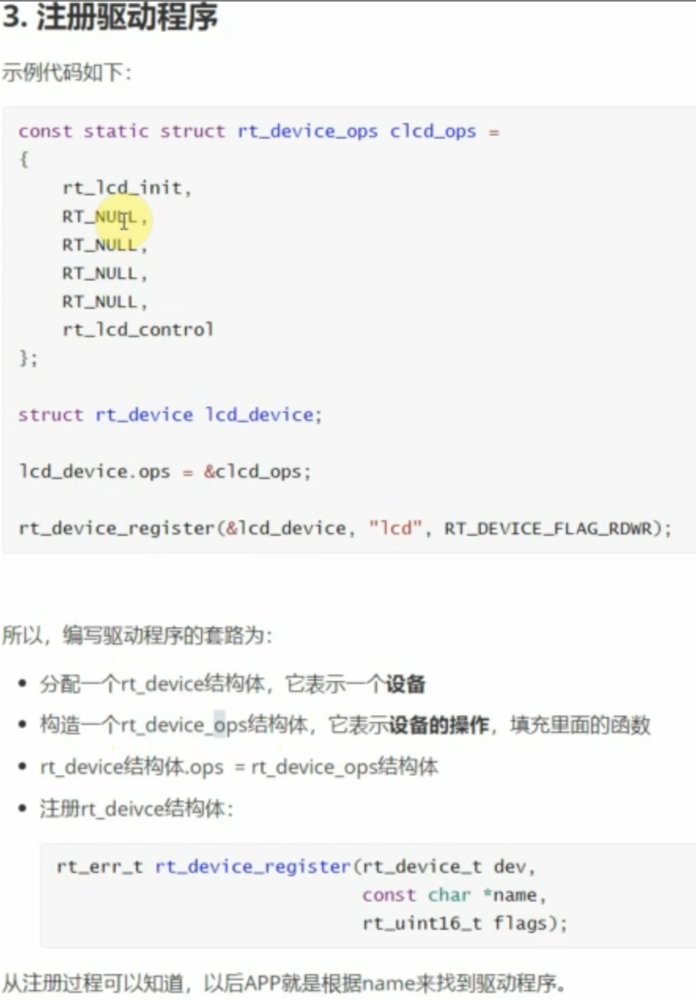
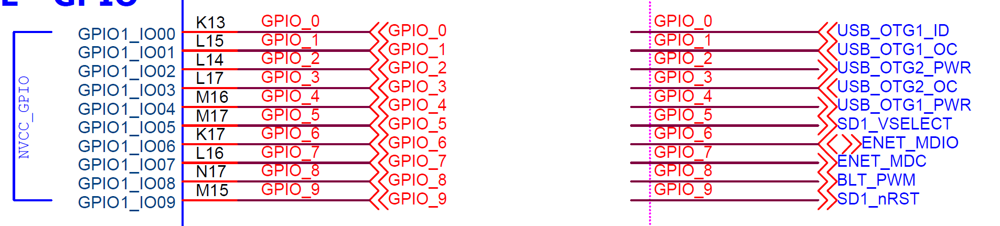

# 应用开发笔记

[^硬件]: 使用飞凌mx6ul开发板

## 一、应用开发方法

根据官方文档的说明，应在`rt-smart/kernal/bsp/boardname/applications`目录下开发用户应用程序

链接地址：https://www.rt-thread.org/document/site/#/rt-thread-version/rt-thread-standard/application-note/setup/standard-project/an0017-standard-project

> BSP 下的 applications 文件夹用于存放用户自己的应用代码，目前只有一个 `main.c `文件。如果用户的应用代码不是很多，建议相关源文件都放在这个文件夹下面，本文在 applications 文件夹下新增了 2 个简单的文件 `hello.c 和 hello.h`。

``` c
/* file: hello.h */

#ifndef _HELLO_H_
#define _HELLO_H_

int hello_world(void);

#endif /* _HELLO_H_ */

/* file: hello.c */
#include <stdio.h>
#include <finsh.h>
#include <rtthread.h>

int hello_world(void)
{
    rt_kprintf("Hello, world!\n");

    return 0;
}

MSH_CMD_EXPORT(hello_world, Hello world!)
```

> 那么用户如何加入自己的应用程序的初始化代码呢？RT-Thread 将 main 函数作为了用户代码入口，只需要在 main 函数里添加自己的代码即可。

``` c
#include <rtthread.h>
#include <board.h>
#include "hello.h"

int main(void)
{
    /* user app entry */

    hello_world();

    return 0;
}
```

> RT-Thread 还支持 finsh，提供一套供用户在命令行的操作接口，通过使用宏 `MSH_CMD_EXPORT()` 就可以新增一个自己命令，并可以在命令行端启动自己的应用代码。

更多内容，包括`SConscript`文件的编写方法，可参考链接页面。

## 二、`helloworld`开发

2.1 在`bsp/board/applications`文件夹下开发

按照文档进行，已实现

2.2以模块方式开发

1. 在`bsp/board`路径下新建文件夹`ledoen`,在该文件夹下新建源文件`ledoen.c, ledoen.h`

2. 在该文件夹下添加`SConscript`文件，内容为

   ```python
   # -*- coding: UTF-8 -*-             # 指定文件的编码格式是 UTF-8，文件可以用中文
   Import('RTT_ROOT')
   Import('rtconfig')
   from building import *
   
   cwd          = GetCurrentDir()      # 将当前路径赋值给字符串 cwd
   include_path = [cwd]                # 将当前头文件路径保存到 list 变量 include_path 中
   src          = []                   # 定义一个 list 变量 src
   
   if GetDepend(['RT_USING_LEDOEN']):   # hello.c 依赖宏 RT_USING_HELLO
       src += ['hello_ledoen.c']              # 保存 hello.c 字符串到 list 变量 src 中
   
   # 将 src 包含的源文件创建为 hello 组。depend 为空表示该组不依赖 rtconfig.h 的任何宏。
   # CPPPATH = include_path 表示将当前目录添加到系统的头文件路径中
   group = DefineGroup('ledoen', src, depend = [''], CPPPATH = include_path)
   
   Return('group')
   ```

3. 修改`rtconfig.h`文件，添加`#define RT_USING_LEDOEN`

3. 编译，下载到开发板（`uboot`方式）运行，成功。可以使用`hello_ledoen`命令成功执行代码

4. 添加开机初始化

   - 在`applications/main.c`文件中添加如下代码

     ``` c
     #include "ledoen.h"
     int main(void)
     {
         ...
         hello_ledoen();
         ...
     }
     ```

   - 编译执行，成功

## 三、LED控制功能开发

###### 硬件连接

开发板上的两个LED连接的管脚为

| led  | GPIO       | 复用管脚     |
| ---- | ---------- | ------------ |
| 2    | GPIO5_IO09 | SNVS_TAMPER9 |
| 3    | GPIO1_IO09 |              |

在第二步的基础上进行开发

修改`ledoen.c`

```c
#include <stdio.h>
#include <finsh.h>
#include <rtthread.h>
/*LED 相关的头文件*/
#include <rtdevice.h>
#include "drv_pin.h"

#define LED_PIN    GET_PIN(1,9)

int hello_ledoen(void)
{
	rt_pin_mode(LED_PIN, PIN_MODE_OUTPUT);
	int i = 0;
	for(i=0; i<59; i++)
	{
		rt_pin_write(LED_PIN, PIN_HIGH);
		rt_thread_mdelay(500);
		rt_pin_write(LED_PIN, PIN_LOW);
		rt_thread_mdelay(500);
	}
	rt_kprintf("hello ledoen!\n");

	return 0;
}
MSH_CMD_EXPORT(hello_ledoen, "hello ledoen!")
```

## 四、加入进程功能

第三步的实现方法会使主界面出现阻塞现象，使用进程/线程功能避免这一现象

线程的创建方式，参考链接：https://www.rt-thread.org/document/site/#/rt-thread-version/rt-thread-standard/programming-manual/thread/thread?id=%e7%ba%bf%e7%a8%8b%e5%ba%94%e7%94%a8%e7%a4%ba%e4%be%8b

在第三步的基础上，修改` ledoen.c`文件

```
#include <stdio.h>
#include <finsh.h>
#include <rtthread.h>
/*LED 相关的头文件*/
#include <rtdevice.h>
#include "drv_pin.h"

#define LED_PIN    GET_PIN(1,9)

#define THREAD_PRIORITY         25
#define THREAD_STACK_SIZE       512
#define THREAD_TIMESLICE        5

static rt_thread_t tid1 = RT_NULL;

/* 线程 1 的入口函数 */
static void thread_LED_entry(void *parameter)
{
	rt_pin_mode(LED_PIN, PIN_MODE_OUTPUT);
	rt_uint32_t i = 0;
	for(i=0; i<59; i++)
	{
		/*每秒钟亮一次，持续1分钟*/
		rt_pin_write(LED_PIN, PIN_LOW);
		rt_thread_mdelay(500);
		rt_pin_write(LED_PIN, PIN_HIGH);
		rt_thread_mdelay(500);
	}
}

int hello_ledoen(void)
{
    /* 创建线程 1，名称是 thread1，入口是 thread1_entry*/
    tid1 = rt_thread_create("thread1",
                            thread_LED_entry, RT_NULL,
                            THREAD_STACK_SIZE,
                            THREAD_PRIORITY, THREAD_TIMESLICE);

    /* 如果获得线程控制块，启动这个线程 */
    if (tid1 != RT_NULL)
	{
        rt_thread_startup(tid1);
	}
	
	rt_kprintf("hello ledoen!\n");

	return 0;
}
MSH_CMD_EXPORT(hello_ledoen, "hello ledoen!")
```

成功运行，避免了阻塞现象发生

但是出现了另外一个弊端，即，如果重复运行`hello_ledon`，则会出现多个线程同时执行的现象，灯的闪烁频率明显高于1s。

## 五、根据文档开发Beeper程序

文档链接：https://www.rt-thread.org/document/site/#/rt-thread-version/rt-thread-standard/tutorial/beep-player/README

说明，原文档使用的是`main.c`作为程序入口，但是经试验，会和applications目录下的`main.c`冲突，因此采用模块开发的方式，在后者中调用我们开发的程序即可。

#### 5.1硬件连接

使用JTAG TRST管脚，复用设置为5即为GPIO1_IO15，对应开发板JTAG插座的第3管脚

将该管脚接入简单的按键电路，按下为高电平

#### 5.2代码

使用示例中的代码，编译下载执行，按键可以成功控制LED的亮、灭

#### 5.3代码分析

##### 定时器相关

- 系统定时器的频率

  在`rtconfig.h`中定义

  ```c
  #define RT_TICK_PER_SECOND 1000
  ```

  即系统定时器（节拍）的频率是`1000Hz`

- 软件定时器的周期只能是系统定时器的倍数

定时器使用的文档连接：https://www.rt-thread.org/document/site/#/rt-thread-version/rt-thread-standard/programming-manual/timer/timer?id=%e8%8e%b7%e5%8f%96%e6%97%b6%e9%92%9f%e8%8a%82%e6%8b%8d

定时器初始化函数及参数说明

```c
rt_timer_t rt_timer_create(const char* name,
                           void (*timeout)(void* parameter),
                           void* parameter,
                           rt_tick_t time,
                           rt_uint8_t flag);
```

| **参数**                        | **描述**                                                     |
| ------------------------------- | ------------------------------------------------------------ |
| name                            | 定时器的名称                                                 |
| void (timeout) (void parameter) | 定时器超时函数指针（当定时器超时时，系统会调用这个函数）     |
| parameter                       | 定时器超时函数的入口参数（当定时器超时时，调用超时回调函数会把这个参数做为入口参数传递给超时函数） |
| time                            | 定时器的超时时间，单位是时钟节拍                             |
| flag                            | 定时器创建时的参数，支持的值包括单次定时、周期定时、硬件定时器、软件定时器等（可以用 “或” 关系取多个值） |
| **返回**                        | ——                                                           |
| RT_NULL                         | 创建失败（通常会由于系统内存不够用而返回 RT_NULL）           |
| 定时器的句柄                    | 定时器创建成功                                               |

#### 5.4代码总结

实现按键的流程

1. 定义按键实体

   - 和按键相关的细节
   - 电平
   - 管脚
   - 按下的时间
   - 触发的事件
   - 回调函数

2. 定义按键的回调函数

3. 创建按键列表

   用于存储多个按键及其通用信息

   - 按键个数
   - 定时器
   - 按键列表

4. 添加按键实体到按键列表

5. 创建定时器

6. 定义定时器超时回调函数

7. 开始定时器

## 六、PWM控制

#### 6.1硬件连接

开发板I2C插座，即CON9的第2脚，为GPIO1_IO04管脚，该管脚复用为ALT1，即为PWM3的输出管脚

#### 6.2PWM驱动开发

驱动程序需要实现的功能

- 端口初始化
- enable实现
- disable实现
- set实现

结构体`rt_device_pwm`

```c
struct rt_device_pwm
{
    struct rt_device parent;
    const struct rt_pwm_ops *ops;
};
```

结构体`rt_pwm_configuration`

```c
struct rt_pwm_configuration
{
    rt_uint32_t channel; /* 0-n */
    rt_uint32_t period;  /* unit:ns 1ns~4.29s:1Ghz~0.23hz */
    rt_uint32_t pulse;   /* unit:ns (pulse<=period) */
};
```


```c
rt_err_t rt_device_pwm_register(struct rt_device_pwm *device,
                                const char *name, 
                                const struct rt_pwm_ops *ops, 
                                const void *user_data);
```

#### 6.3PWM驱动开发总结

##### Step1阅读上层代码，了解需求

rtthread的驱动是分层的，对于PMW设备，rtthread已经实现了中间层次的设备供应用层次调用，即`rt_device_pwm`，开发者需要做的是实现最底层的驱动代码，使`rt_device_pwm`落地。

`rt_device_pwm`相关代码位于

- `rt-smart\kernel\components\drivers\include\drivers\rt_drv_pwm.h`
- `rt-smart\kernel\components\drivers\misc\rt_drv_pwm.c`

其中，头文件的内容如下

```c
#define PWM_CMD_ENABLE      (128 + 0)
#define PWM_CMD_DISABLE     (128 + 1)
#define PWM_CMD_SET         (128 + 2)
#define PWM_CMD_GET         (128 + 3)

struct rt_pwm_configuration
{
    rt_uint32_t channel; /* 0-n */
    rt_uint32_t period;  /* unit:ns 1ns~4.29s:1Ghz~0.23hz */
    rt_uint32_t pulse;   /* unit:ns (pulse<=period) */
};

struct rt_device_pwm;
struct rt_pwm_ops
{
    rt_err_t (*control)(struct rt_device_pwm *device, int cmd, void *arg);
};

struct rt_device_pwm
{
    struct rt_device parent;
    const struct rt_pwm_ops *ops;
};

rt_err_t rt_device_pwm_register(struct rt_device_pwm *device, const char *name, const struct rt_pwm_ops *ops, const void *user_data);

rt_err_t rt_pwm_enable(struct rt_device_pwm *device, int channel);
rt_err_t rt_pwm_disable(struct rt_device_pwm *device, int channel);
rt_err_t rt_pwm_set(struct rt_device_pwm *device, int channel, rt_uint32_t period, rt_uint32_t pulse);
```



​																				         韦东山老师的讲解

##### 说明

在rtthread的源码中，使用了面向对象的编程思想，和类对应的是结构体，结构体间的继承类似为

```c
struct rt_device
{
    struct rt_object          parent;                   /**< inherit from rt_object */
	...
}
```

也就是说，如果结构体A的第一个对象也是另外一个结构体B，就可以说结构体A是继承自结构体B？

从后面的类型转换来看，是这样的

例如：

```c
struct rt_device_pwm
{
    struct rt_device parent;			//继承自rt_device？
    const struct rt_pwm_ops *ops;
};
```

##### 发现（解答数据类型转换的疑问）

###### 问题描述

有如下代码，令人费解

在`drv_pwm`层

```c
static rt_err_t swm_pwm_enable(struct rt_device_pwm *pwm_device, struct rt_pwm_configuration *configuration, rt_bool_t enable)
{
    /*获取PWM寄存器基地址*/
	struct imx_pwm *pwm = RT_NULL;
    PWM_Type *periph = RT_NULL;

    RT_ASSERT(RT_NULL != pwm_device);

    pwm = (struct imx_pwm*)pwm_device;  //可以将rt_device_pwm直接强制转换为struct imx_pwm*？
    periph = (PWM_Type*)pwm->periph.vaddr;
    ...
}
```

在`rt_device_pwm`层

```c
static rt_err_t _pwm_control(rt_device_t dev, int cmd, void *args)
{
    rt_err_t result = RT_EOK;
    struct rt_device_pwm *pwm = (struct rt_device_pwm *)dev;	//可以将rt_device_t强制转换为rt_device_pwm*？
	...
}
```

###### 答案

`register`函数很重要

在`drv_pwm`层

```c
	rt_device_pwm_register(
	&_s_pwm.parent, 	//_s_pwm是struct imx_pwm*型
	_s_pwm.name, 
	&pwm_ops, 
	RT_NULL);
```

在`rt_device_pwm`层

```c
result = rt_device_register(
    &device->parent, //device是rt_device_pwm型
    name, 
    RT_DEVICE_FLAG_RDWR)
```

也就是说，在注册时实际上传递的是子类型？只能这样解释了

##### Step2构造底层驱动

核心任务由两个

1. 初始化需要使用的PWM通道的硬件设置
   - GPIO
   - 时钟
   - 中断
2. 构造ops结构体

## 七、完整播放器开发

管脚使用

| 序号 | GPIO       | 复用      | 作用          | 开发板位置   |
| ---- | ---------- | --------- | ------------- | ------------ |
| 1    | GPIO1_IO15 | JTAG TRST | 上一曲/音量减 | JTAG插座3脚  |
| 2    | GPIO1_IO12 | JTAG TDO  | 暂停/播放     | JTAG插座13脚 |
| 3    | GPIO1_IO13 | JTAG TDI  | 下一曲/音量加 | JTAG插座5脚  |

## 八、完善PWM驱动

###### 可用PWM管脚



| 序号 | PWM      | 复用管脚   | 开发板位置  |
| ---- | -------- | ---------- | ----------- |
| 1    | PWM2_OUT | GPIO1_IO09 | LED3        |
| 2    | PWM3_OUT | GPIO1_IO04 | I2C插座2脚  |
| 3    | PWM6_OUT | JTAG_TDI   | JTAG插座5脚 |
| 4    | PWM7_OUT | JTAG_TCK   | JTAG插座9脚 |
| 5    | PWM8_OUT | JATG_TRST  | JTAG插座3脚 |

###### 修改驱动支持多个PWM设备

1. 将`_s_pwm`修改为数组
2. 将PWM设备的初始化代码放入到`swm_pwm_enable`中
3. 在`rt_hw_pwm_init`中实现每个PWM设备的虚拟基地址获取

修改后的代码如下

`drv_pwm.h`

```c
#ifndef _DRV_PWM_H__
#define _DRV_PWM_H__

#include "board.h"
#include "drv_common.h"

struct imx_periph
{
    rt_uint32_t                 paddr;
    rt_uint32_t                 vaddr;
};

struct imx_pwm
{
    struct rt_device_pwm     	parent;

    const char                  *name;
    struct imx_periph           periph;
	
    struct imx6ull_iomuxc       gpio;
};

int rt_hw_pwm_init(void);
#endif
```

`drv_pwm.c`

```
#include <rtconfig.h>
#include "board.h"
#include "drv_pwm.h"
#include "drv_common.h"

_internal_rw struct imx_pwm _s_pwm[] = 
{
    {
        .name = "pwm2",
        .periph.paddr = IMX6ULL_PWM2_BASE,
        .gpio ={IOMUXC_GPIO1_IO09_PWM2_OUT,     0, 0x10B0},
    },
    {
        .name = "pwm3",
        .periph.paddr = IMX6ULL_PWM3_BASE,
        .gpio = {IOMUXC_GPIO1_IO04_PWM3_OUT,     0, 0x10B0},
    }
};

static void _pwm_gpio_init( struct imx_pwm *device )
{
	imx6ull_gpio_init(&device->gpio);
}

static rt_err_t swm_pwm_control(struct rt_device_pwm *pwm_device, int cmd, void *arg);
static struct rt_pwm_ops pwm_ops = { swm_pwm_control };

static rt_err_t swm_pwm_enable(struct rt_device_pwm *pwm_device, struct rt_pwm_configuration *configuration, rt_bool_t enable)
{
    /*获取PWM寄存器基地址*/
	struct imx_pwm *pwm = RT_NULL;
    PWM_Type *periph = RT_NULL;

    RT_ASSERT(RT_NULL != pwm_device);

    pwm = (struct imx_pwm*)pwm_device;
    periph = (PWM_Type*)pwm->periph.vaddr;

    if (!enable)
    {
        /*关闭PWM*/
		periph->PWMCR &= ~(1 << 0);
    }
    else
    {
        /*输出管脚初始化*/
        _pwm_gpio_init(pwm);
        /*时钟初始化*/
        periph->PWMCR = 0;
        periph->PWMCR = ((1 << 16) | (65 << 4));
        /* 设置IR寄存器，禁止所有中断使能 */
        periph->PWMIR = 0;
        /*使能PWM*/
		periph->PWMCR |= (1 << 0);
    }

    return RT_EOK;
}

static rt_err_t swm_pwm_get(struct rt_device_pwm *pwm_device, struct rt_pwm_configuration *configuration)
{
    return RT_EOK;
}

static rt_err_t swm_pwm_set(struct rt_device_pwm *pwm_device, struct rt_pwm_configuration *configuration)
{
	rt_uint16_t i;

    struct imx_pwm *pwm = RT_NULL;
    PWM_Type *periph = RT_NULL;

    RT_ASSERT(RT_NULL != pwm_device);

    pwm = (struct imx_pwm*)pwm_device;
    periph = (PWM_Type*)pwm->periph.vaddr;
	
	periph->PWMPR = configuration->period;
	
	for(i=0; i<3; i++)
	{
		periph->PWMSAR = configuration->pulse;
	}

    return RT_EOK;
}

static rt_err_t swm_pwm_control(struct rt_device_pwm *pwm_device, int cmd, void *arg)
{
    RT_ASSERT(pwm_device != RT_NULL);

    struct rt_pwm_configuration *configuration = (struct rt_pwm_configuration *)arg;

    switch (cmd)
    {
    case PWM_CMD_ENABLE:
        return swm_pwm_enable(pwm_device, configuration, RT_TRUE);
    case PWM_CMD_DISABLE:
        return swm_pwm_enable(pwm_device, configuration, RT_FALSE);
    case PWM_CMD_SET:
        return swm_pwm_set(pwm_device, configuration);
    case PWM_CMD_GET:
        return swm_pwm_get(pwm_device, configuration);
    default:
        return RT_EINVAL;
    }
}

int rt_hw_pwm_init(void)
{
    for (uint8_t i = 0; i < GET_ARRAY_NUM(_s_pwm); i++)
    {
        _s_pwm[i].periph.vaddr = platform_get_periph_vaddr(_s_pwm[i].periph.paddr);
        
        rt_device_pwm_register(
        &_s_pwm[i].parent, 
        _s_pwm[i].name, 
        &pwm_ops, 
        RT_NULL);
    }
	
	return RT_EOK;
}
INIT_DEVICE_EXPORT(rt_hw_pwm_init);
```


## 九、LED驱动重新开发

###### 功能设计

- 实现开发板上两个LED的驱动
- 留给应用层直接以LED序号调用

###### 接口设计

``` c
//初始化管脚
int init_led(int led);

//点亮LED
int led_on(int led);

//关闭LED
int led_off(int led);

//反转LED
int toggle_led(int led);
```

