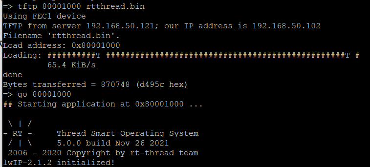
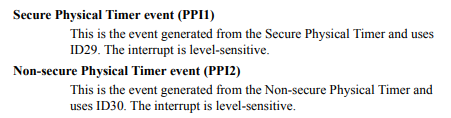
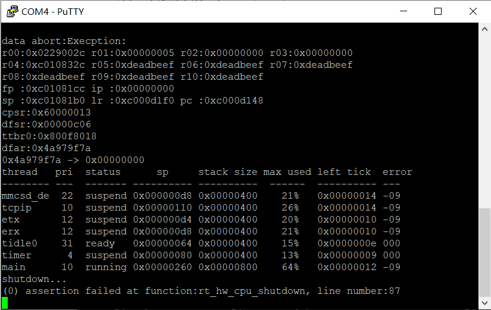
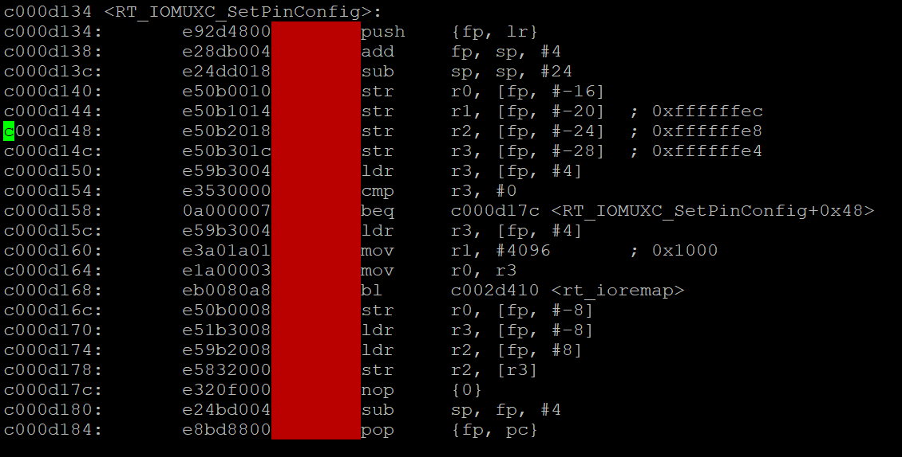
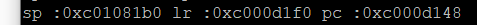
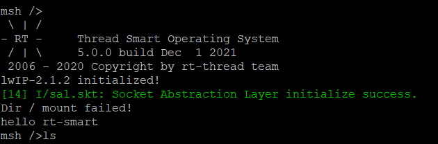

# 移植笔记

## 1.物理地址

起始0x8000 0000

虚拟地址起始 0xC000 0000

PV_OFFSET = 0x8000 0000 - 0xC000 0000 = 0xC000 0000

使用menuconfig修改PV_OFFSET

`scons --menuconfig`

## 2.内存大小

512M = 0x1FFF FFFF

修改drivers/board.c文件

``` c
struct mem_desc platform_mem_desc[] = {  /* ddr 512M */
    {KERNEL_VADDR_START, KERNEL_VADDR_START + 0x1FFFFFFF, KERNEL_VADDR_START + PV_OFFSET, NORMAL_MEM}
}
```

# 3.GIC

使用GIC V2.0版本

## 4.串口

使用UART1，寄存器基地址为` 0x0202 0000`

修改GPIO，imx6ull和imx6ul的GPIO略有不同（不改也可以运行）

开发板使用的管脚

``` makefile
IOMUXC_SetPinMux(IOMUXC_UART1_TX_DATA_UART1_TX, 0);
IOMUXC_SetPinMux(IOMUXC_UART1_RX_DATA_UART1_RX, 0);
```


## 5.第一次成功

将rtthread.bin下载到0x80001000（使用u-boot），然后go 80001000，成功出现打印信息



或者将rtthread.imx下载到0x80000400（使用u-boot），然后go 80001000，成功打印出上述信息

## 6.第二次成功

将rtthread.bin使用imx6ul官方SDK提供的mkimage.sh工具生成.img文件

需要对mkimage.sh工具进行修改，将下句中的2000修改为1000

` ../bin/$IMG_BUILDER --combine base_addr=0x80000000 ivt_offset=0x400 app_offset=0x2000 dcd_file=dcd.bin app_file=sdk20-app.bin ofile=sdk20-app.img image_entry_point=0x80002000`

即

` ../bin/$IMG_BUILDER --combine base_addr=0x80000000 ivt_offset=0x400 app_offset=0x1000 dcd_file=dcd.bin app_file=sdk20-app.bin ofile=sdk20-app.img image_entry_point=0x80001000`

即可，然后运行` mkimage.sh sd`

将生成的` sdk20-app.img`文件下载（使用u-boot）到80000000，然后go 80001000，串口成功打印

问题，生成img文件，前0x400字节为全1数据，如果拷入SD卡，是否会损坏SD的分区表

解决办法，再次修改mkimage.sh文件，将base_addr、ivt_offset和app_offset修改，修改为：

` ../bin/$IMG_BUILDER --combine base_addr=0x80000400 ivt_offset=0x000 app_offset=0xc00 dcd_file=dcd.bin app_file=sdk20-app.bin ofile=sdk20-app.img image_entry_point=0x80001000`

将生成的` sdk20-app.img`文件下载（使用u-boot）到80000400，然后go 80001000，串口成功打印

## 7.将img文件写入SD卡，从SD卡启动

#### Step1

将SD卡接入虚拟机，通过ls /dev指令确定sd卡是那个设备，例如sdb

#### Step2

使用以下语句将img文件写入SD卡

``` dd if=/dev/zero of=/dev/sdb bs=1k seek=1 count=1000 ``` 

```dd if=rtthread.imx of=/dev/sdb bs=1k seek=1 conv=fsync```

 #### Step3

将开发板上的启动拨片开关拨至SD卡启动位置

> emmc启动：1、4、5、8 ON
>
> SD启动：1、4 ON

 #### Step4

上电，串口打印失败

原因分析：没有时钟等的初始化

 程序仍是正常的，以下可以说明：

```makefile
//进入emmc的uboot
//将sd卡设为当前mmc设备
mmc dev 0
//从sd卡的第2个扇区开始读2000个扇区到0x80000400
mmc read 80000400 2 2000
//跳转到80001000
go 80001000

//串口成功打印
```

## 8.Generic Timer移植

中断号29或30（出处cortex_a7_mpcore）

 

#### 调试错误信息

程序运行后崩溃，如下图



根据PC指针可知，崩溃于0xc00d148，对elf文件反编译，可以知道，崩溃于函数RT_IOMUXC_SetPinConfig



同时可以看到有意思的提示，PC指针指向的是一个子函数，lr指针的上一个指令调用了该函数



反编译指令

``` makefile
arm-linux-musleabi-objdump -D -m arm rtthread.elf > rtthread.dis
```

## 9.第三次成功，从SD卡启动

根据裸板UART程序，在drv_uart.c中修改UART的时钟代码

``` c
    periph->UFCR |=  UART_UFCR_RFDIV(1);
    periph->UBIR = UART_UBIR_INC(71);
    periph->UBMR = UART_UBMR_MOD(624);
```

将rtthread.imx（此处使用的镜像文件为rtthread生成的imx文件，而不是第7步提到的使用NXP官方SDK工具生成的img文件）写入sd卡，成功打印信息



## 10.移植UL的官方SDK

开发板使用的芯片为MCIMX6G2
